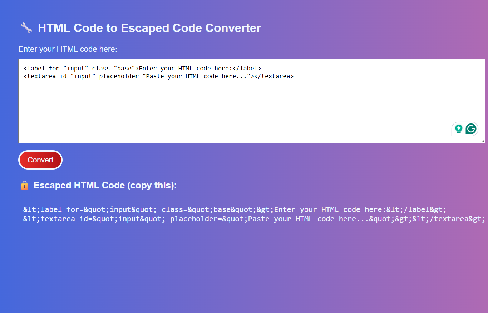

# HTML-Code-to-Escaped-Code-Converter
# 🔄 HTML Code to Escaped Code Converter

A lightweight web tool that converts raw HTML code into escaped HTML entities, allowing you to safely display code examples in tutorials, blogs, or documentation without the browser rendering them.

---

## 💡 Why Use This?

Displaying raw HTML code on a webpage can be tricky, as browsers try to interpret and render it. This tool solves that by converting characters like `<`, `>`, `"`, and `&` into their HTML-safe versions (`&lt;`, `&gt;`, `&quot;`, `&amp;`), making your code visible and readable.

---

## 🚀 Features

- ✅ Instantly convert HTML to escaped HTML entities
- ✅ Supports common HTML special characters
- ✅ Copy-paste friendly output
- ✅ Minimal, responsive UI
- ✅ Pure HTML, CSS, and JavaScript — no libraries or frameworks

---

## 🔧 How to Use

1. Paste your HTML code into the input box.
2. Click the **Convert** button.
3. Copy the escaped code from the output section.
4. Use it inside `<pre><code>` blocks or anywhere HTML rendering is unsafe.

---

## 📷 Screenshot

---

## 🛠️ Tech Stack

- HTML5
- CSS3
- JavaScript (Vanilla)

---
## 📁 Project Structure

html-code-escaped-converter/
│
├── index.html # Main application page
├── style.css # (Optional) External styling file
├── script.js # (Optional) JavaScript logic
└── README.md # You're here!

## 🌐 Live Demo

👉 https://sakshi-1011.github.io/HTML-Code-to-Escaped-Code-Converter/  

## ✍️ Author

**Sakshi Shelke**  
Frontend Developer | Web Enthusiast  

## 🤝 Contributions

Pull requests, issues, and suggestions are welcome!  
Feel free to fork the repo and improve it.

